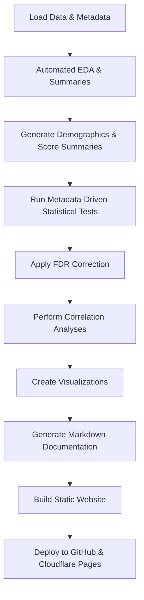

# IES-3 Data Analysis & Automated Documentation

This project performs automated analysis and visualization of IES-3 survey data, generating a fully automated, version-controlled documentation website. The entire process — from data processing to publishing — is orchestrated via scripts and continuous deployment.

## Output

1. **Variable Summary:** Descriptions of each variable individually
2. **Bivariate Relationships:** Correlations and relationships between pairs of variables
3. **Statistical Analysis:** t-tests and ANCOVAs of scores and subscores

## Automated Workflow Overview

### Pipeline Overview



## Analysis Plan

### 1. Data Loading & Validation

- Load raw survey data (TSV) and metadata (JSON).
- Convert categorical variables using metadata mappings.
- Convert outcome variables to numeric.
- Handle missing values and perform validation checks.

### 2. Automated EDA & Summaries

- Summarize dataset shape, columns, data types.
- Count missing values and unique values.
- Generate descriptive statistics.
- Save EDA summaries.

### 3. Demographics & Score Summaries

- Use metadata to identify demographic variables.
- Generate counts and percentages for categories.
- Summarize IES-3 total and subscale scores.
- Save tables to CSV.

### 4. Metadata-Driven Statistical Testing

- Automatically select variables for:
  - T-tests (binary groups)
  - ANOVA (multi-category groups)
  - Correlations (continuous variables)
- Calculate effect sizes (Cohen’s d, eta-squared).
- Save all results to CSV.

### 5. Multiple Comparisons Correction

- Apply False Discovery Rate (FDR) correction across all p-values.
- Save corrected results.

### 6. Correlation Analyses

- Pearson and Spearman correlations for numeric variables.
- Cramér’s V for categorical associations.
- Save correlation matrices.

### 7. Visualization

- Distribution plots, boxplots, heatmaps, pair plots.
- Highlight significant results.
- Save all plots as PNG files.

### 8. Automated Documentation

- Generate Markdown files summarizing:
  - Data and metadata
  - Statistical results
  - Visualizations
- Organize content for MkDocs.

### 9. Static Site Build & Deployment

- Build the MkDocs static site.
- Deploy to GitHub Pages (`gh-pages` branch).
- Cloudflare Pages follows the same branch for hosting.

## Script Documentation

### `scripts/orchestrator.py`

- **Main entry point** for the entire pipeline.
- Calls all other modules in sequence.
- Generates Markdown documentation content.
- Handles file outputs.

### `scripts/data_loader.py`

- Loads raw data and metadata.
- Converts variables based on metadata.
- Provides helper functions for variable selection and transformation.

### `scripts/statistical_analysis.py`

- Performs t-tests, ANOVA, correlations.
- Calculates effect sizes.
- Applies FDR correction.
- Outputs results as CSV.

### `scripts/visualization.py`

- Generates all plots:
  - Distributions
  - Boxplots
  - Heatmaps
  - Pair plots
  - Categorical association heatmaps
- Saves plots as PNG files.

### `scripts/eda.py`

- Performs exploratory data analysis.
- Summarizes missing data, unique values, and descriptive stats.
- Outputs EDA summaries.

### `generate_report.py`

- (Optional) Additional report generation or orchestration.

On every push to `main` or `master`:

1. **Checkout code and data**
2. **Install dependencies**
3. **Run the orchestrator script** to:
    - Load data and metadata
    - Perform exploratory data analysis (EDA)
    - Generate demographics and summary statistics
    - Run metadata-driven statistical tests
    - Create visualizations
    - Save all outputs to the `results/` directory
    - Generate Markdown documentation content
4. **Build the MkDocs static site**
5. **Deploy the site** to the `gh-pages` branch
6. **GitHub Pages and Cloudflare Pages** serve the latest documentation

## Usage

### Running the Pipeline Locally

1. **Install dependencies**

```bash
pip install -r requirements.txt
```

2. **Run the orchestrator**

```bash
python scripts/orchestrator.py
```

Outputs will be saved in the `results/` directory, and documentation content will be generated for the site.

### Building and Previewing Documentation Locally

```bash
mkdocs serve
```

Then open [http://127.0.0.1:8000](http://127.0.0.1:8000) in your browser.

## Repository Structure

```
├── data/                   # Raw data and metadata
├── results/                # Generated analysis outputs and figures
├── docs/                   # Markdown docs (generated and manual)
├── scripts/                # Data processing and analysis scripts
│   ├── orchestrator.py     # Main pipeline script
│   ├── data_loader.py      # Data and metadata loading
│   ├── statistical_analysis.py  # Statistical tests
│   └── visualization.py    # Plotting functions
├── mkdocs.yml              # MkDocs configuration
├── requirements.txt        # Python dependencies
└── .github/workflows/      # GitHub Actions CI/CD workflows
```

## Dependencies

- pandas
- numpy
- scipy
- altair
- tabulate
- mkdocs
- mkdocs-material
- mkdocs-charts-plugin
- jinja2
- pyyaml
- pingouin

Install all with:

```bash
pip install -r requirements.txt
```
