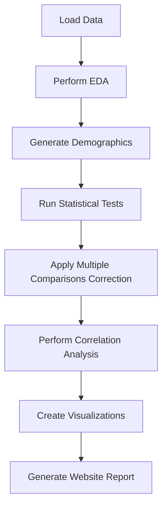

# Suggestions for Improving the Data Analysis Pipeline

## Status Legend
- [x] **Completed**
- [ ] **Planned / In Progress**
- * Unplanned / Deferred

---

## Suggestions with Status

- [x] **Integrate correlation analysis**  
  Incorporated into the unified metadata-driven statistical analysis.

- [x] **Unify statistical analysis functions using metadata**  
  Fully implemented with FDR correction and saved outputs.

- [x] **Modularize demographics generation**  
  Now a reusable function in `data_loader.py`.

- [x] **Enhance documentation**  
  Added summary diagram and improved comments.

- * **Improve error handling**  
  Deferred for now.

- [ ] **Automate report generation as a website**  
  Planned: MkDocs static site with GitHub Actions, structured pages, and dynamic highlights.

- * **Use logging instead of print statements**  
  Deferred for now.

- [ ] **Simplify and optimize code further**  
  Planned: Avoid any remaining manual calculations, use library functions.

- [ ] **Additional visualizations**  
  Planned: Violin plots, swarm plots, effect size visualizations.

---

## Detailed Reporting Requirements

### Overview

- **Static website** generated with MkDocs (or similar).
- **Automated build** via GitHub Actions on data/code changes.
- **Modular content**: separate pages for overview, EDA, statistics, correlations, visualizations.
- **Consistent styling** using mkdocs-material theme.
- **Interactive elements** where feasible (e.g., collapsible sections, sortable tables).

### Site Structure

- **Home Page (`index.md`)**
  - Project overview and goals, e.g., 
  - Navigation menu.
  - Summary of key significant findings with links to details.
  - Date/time of last update.

- **Data Summary Page (`data_summary.md`)**
  - Dataset description (rows, columns, missing data).
  - Demographics table (embedded CSV or markdown table).
  - Score summaries (means, SDs).
  - Download links for raw data and processed CSVs.

- **EDA Page (`eda.md`)**
  - Distribution plots (histograms, boxplots).
  - Missing data heatmaps or summaries.
  - Categorical variable breakdowns.
  - Key insights or anomalies.

- **Statistical Analysis Page (`analysis.md`)**
  - T-test results table with effect sizes.
  - ANOVA results with group stats.
  - Point-biserial correlations.
  - Eta squared results.
  - Highlight statistically significant results (e.g., bold, color, or icons).
  - Download links for CSVs.

- **Correlations Page (`correlations.md`)**
  - Pearson and Spearman correlation matrices (heatmaps and CSVs).
  - Cramér's V heatmaps for categorical associations.
  - Interpretation notes.

- **Visualizations Page (`visualizations.md`)**
  - All generated plots (saved as PNGs).
  - Captions explaining each plot.
  - Optionally, interactive plots (Plotly, Altair).

### File Organization

- `docs/`
  - `index.md`, `data_summary.md`, `eda.md`, `analysis.md`, `correlations.md`, `visualizations.md`
  - `assets/`
    - `images/` (all PNGs)
    - `tables/` (all CSVs)
- `mkdocs.yml` configuration file with navigation and theme settings.

### Automation Details

- **Script or Makefile** to:
  - Run the full analysis pipeline.
  - Export markdown files with embedded results.
  - Copy images and CSVs into `docs/assets/`.
- **GitHub Actions workflow** to:
  - Set up environment.
  - Run the above script.
  - Build and deploy the MkDocs site to GitHub Pages.

### Styling and Interactivity

- Use **mkdocs-material** theme for clean navigation.
- Highlight significant results (e.g., p < 0.05) with:
  - Bold text.
  - Color coding (green/red).
  - Icons or badges.
- Use collapsible sections for detailed tables.
- Optionally, add interactive tables (DataTables.js) or plots (Plotly).

### Integration with Analysis Pipeline

- Modify analysis scripts to:
  - Save outputs in `results/` with consistent naming.
  - Generate markdown snippets or full pages programmatically.
  - Link CSVs and images in markdown.
- Ensure all outputs are reproducible and update automatically.

---

## Summary Diagram

---

This expanded specification provides a clear blueprint for building a comprehensive, automated, and user-friendly reporting website.