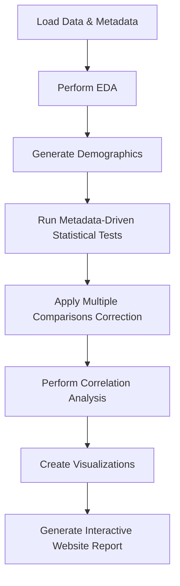

# Suggestions and Finalized Implementation Plan

This file contains both the **status of suggestions** and the **detailed, finalized plan** for the data analysis pipeline, reporting, and deployment. It should be referenced throughout development and build processes.

---

## Status Legend
- [x] **Completed**
- [ ] **Planned / In Progress**
- * Unplanned / Deferred

---

## Suggestions with Status

- [x] Integrate correlation analysis
- [x] Unify statistical analysis functions using metadata
- [x] Modularize demographics generation
- [x] Enhance documentation
- * Improve error handling
- [ ] Automate report generation as a website
- * Use logging instead of print statements
- [ ] Simplify and optimize code further
- [ ] Additional visualizations

---

## Success Criteria for Remaining Steps

### Automate report generation as a website

- Markdown files are generated for all report pages (`index.md`, `data_summary.md`, `eda.md`, `analysis.md`, `explore.md`, `visualizations.md`).
- Each page **embeds Vega-Lite JSON specs** inside ```vegalite code blocks.
- All charts render interactively in MkDocs with `mkdocs-charts-plugin`.
- All relevant tables (demographics, scores, stats) are embedded as markdown tables.
- The report can be **rebuilt automatically** after analysis updates.
- The report is **clear, navigable, and matches the planned content**.

### MkDocs local testing

- `mkdocs serve` runs without errors.
- All pages load correctly in the browser.
- Embedded Vega-Lite charts render interactively.
- Navigation and styling are correct with mkdocs-material theme.
- **Force refresh (Ctrl+Shift+R) shows latest content after rebuild.**

### Deployment (GitHub Pages and Cloudflare Pages)

- `mkdocs build` completes without errors.
- Site deploys successfully to both platforms.
- Live site matches local preview.
- Interactive charts work on deployed site.
- Navigation and styling are preserved.
- **GitHub Actions workflow supports force deploy:**
  - Can be triggered manually or on push.
  - **Overrides existing site content** to ensure latest version is live.
  - Uses `--force` or equivalent to push changes even if no diff detected.
  - Provides clear logs of deployment status.

### Simplify and optimize code further

- Visualization and report generation code is **modular, readable, and minimal**.
- Avoid redundant calculations or file exports.
- Use **Altair's declarative API** for all charts.
- Use **pandas** for all table generation.
- No unnecessary dependencies or complex logic.

### Additional visualizations

- Violin plots, swarm plots, effect size plots are **implemented as Altair charts**.
- Embedded in the appropriate markdown pages.
- Interactive features (filtering, tooltips) are enabled.
- Visualizations are **clear, informative, and consistent**.

### Improve error handling (deferred)

- The pipeline **skips missing or empty data gracefully**.
- Clear warnings are printed if expected outputs are missing.
- The report still builds even if some parts fail.

---

## Finalized Implementation Plan (Updated)

### Visualization Strategy

- Use **Altair** for nearly all plots: histograms, bar charts, boxplots, violin plots, scatter plots, heatmaps, pair plots.
- Enable interactive filtering, tooltips, drill-downs.
- **Instead of exporting PNGs or HTML, save Altair charts as Vega-Lite JSON specs.**
- **Embed these JSON specs directly in markdown** inside fenced code blocks with language `vegalite`.
- MkDocs with `mkdocs-charts-plugin` will render these as interactive charts.
- Use markdown or DataTables.js for tabular data.

### Per-Page Content

- **Home:** Overview, goals, key significant findings (links), update timestamp.
- **Data Summary:** Dataset info, variable definitions, demographics, score summaries, downloads.
- **EDA:** Distributions, missing data, unique counts, insights, **embedded Vega-Lite charts**.
- **Statistical Analysis:** T-tests, ANOVA, correlations, effect sizes, violin/boxplots, highlights, downloads, **embedded Vega-Lite charts**.
- **Explore:** Interactive pair plots, correlation heatmaps, categorical associations, client-side filtering, **embedded Vega-Lite charts**.
- **Visualizations:** All charts embedded as Vega-Lite JSON specs with captions.

### Variable Mapping

- **Demographics:** Gender, School, Year in school
- **Independents:** Eating disorder history, Told to change weight, Weight-sensitive sport, Endurance sport
- **Outcomes:** SS1-4 avg, Total Score Avg
- **Ignored:** Inclusion criteria, free text, raw question scores

### Deployment

- **Build once** with GitHub Actions:
  - Run analysis, generate markdown, export Altair JSON specs.
  - Build MkDocs site.
- **Deploy to both:**
  - GitHub Pages (push to `gh-pages`)
  - Cloudflare Pages (via repo integration or API)
- **Single workflow** handles both deployments.
- **Supports force deploy** to override existing site content and ensure latest version is live.

### Tech Stack Choices

| Component | Preferred | Alternatives | Rationale |
|-----------|-----------|--------------|-----------|
| Static site | MkDocs + mkdocs-material | Sphinx, Hugo | Simplicity, Python-native |
| Hosting | GitHub Pages, Cloudflare Pages | Netlify, Vercel | Free, easy |
| Interactive viz | Altair/Vega-Lite embedded as JSON | Plotly, Observable | Declarative, lightweight, markdown-embeddable |
| Tables | Markdown, DataTables.js | ag-Grid, Tabulator | Simplicity |
| Automation | GitHub Actions | Makefile, manual | Easy CI/CD |

### Summary Diagram



---

## Reference

This plan supersedes previous drafts. Use it as the **source of truth** during implementation, automation, and reporting.